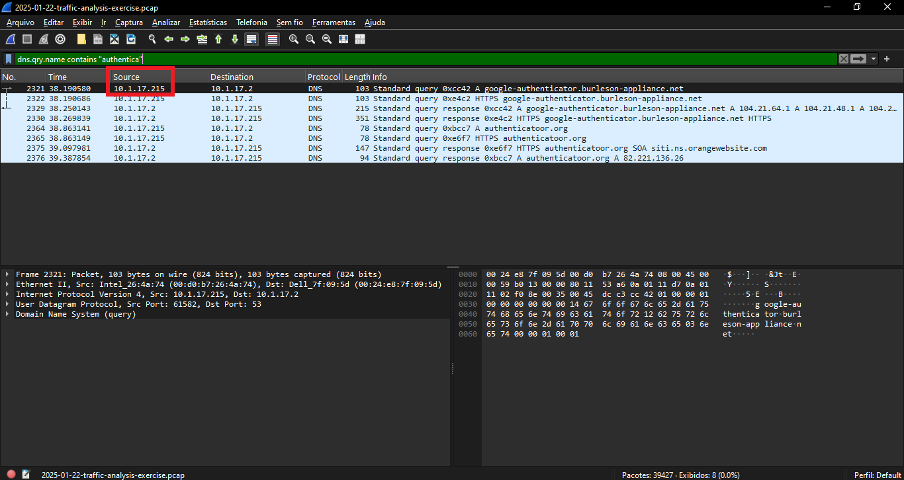
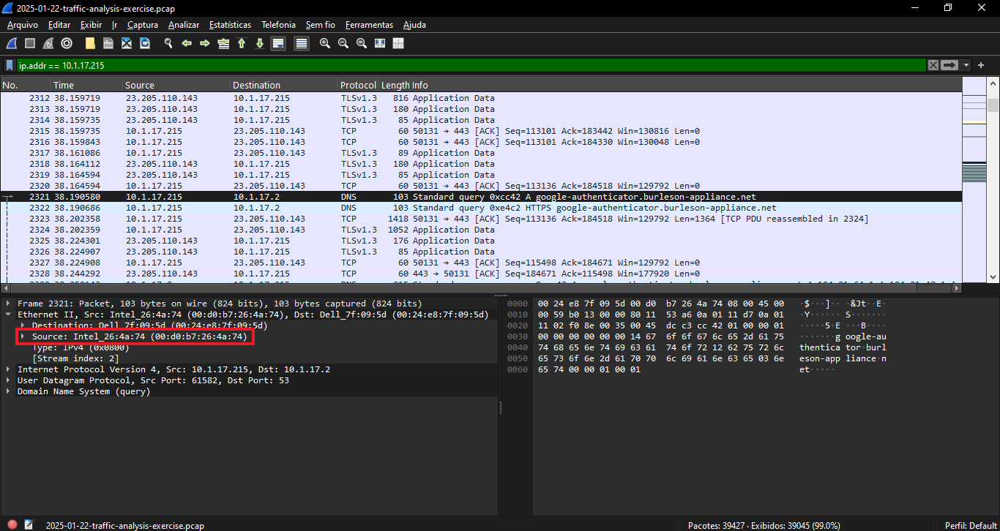
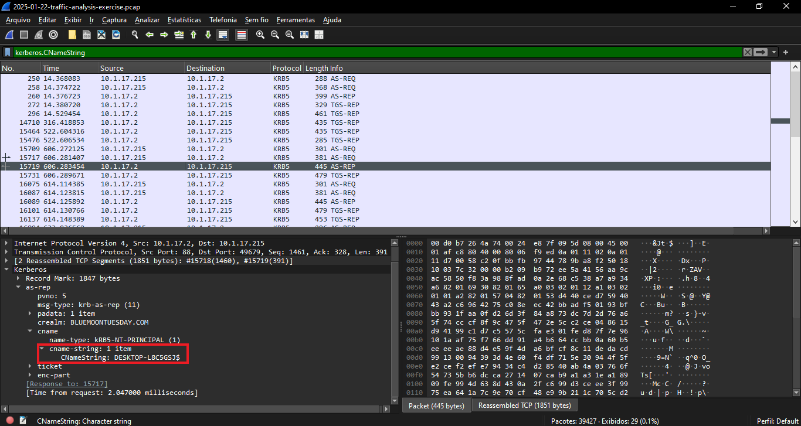
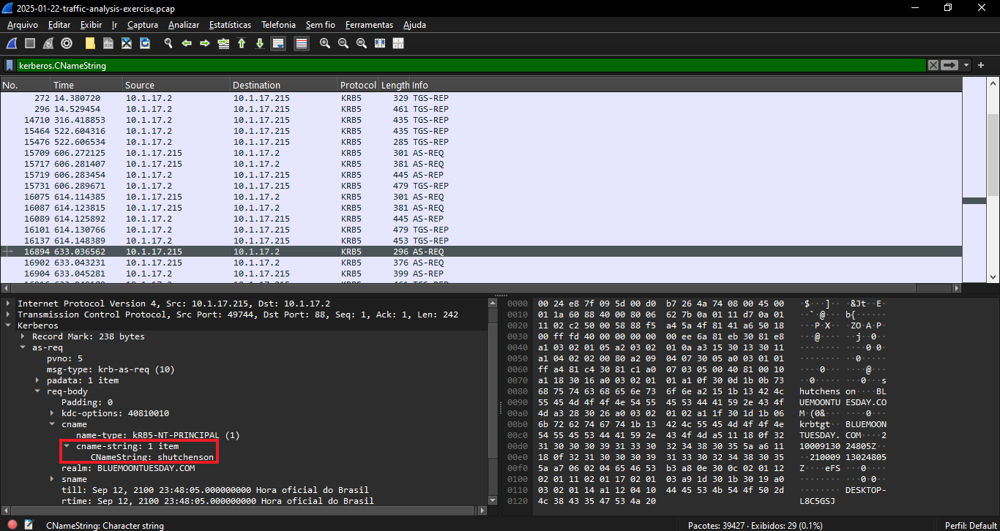
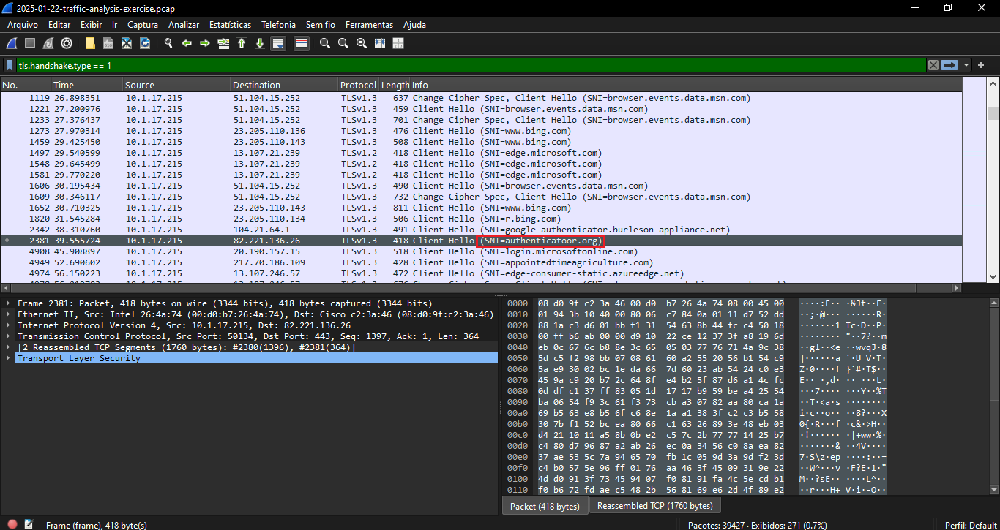
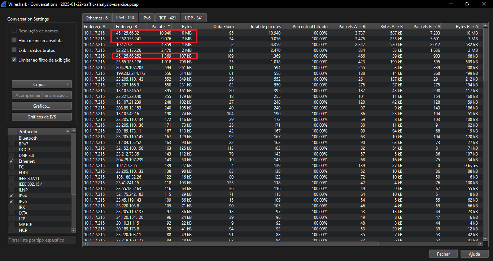
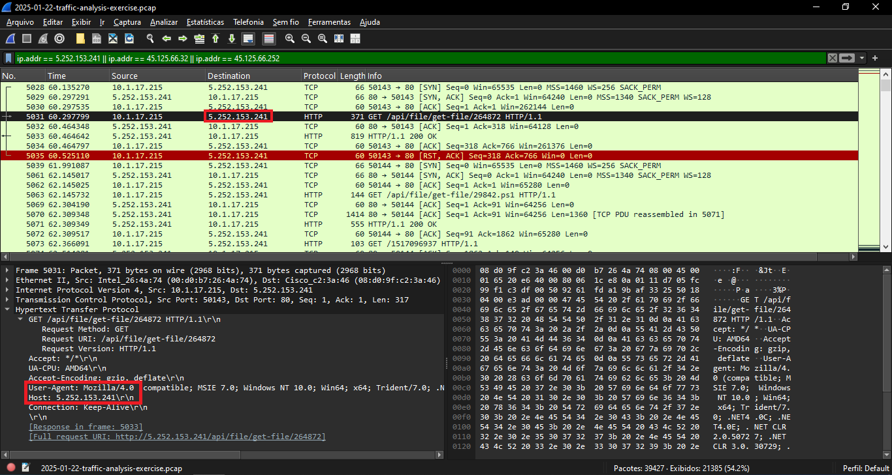
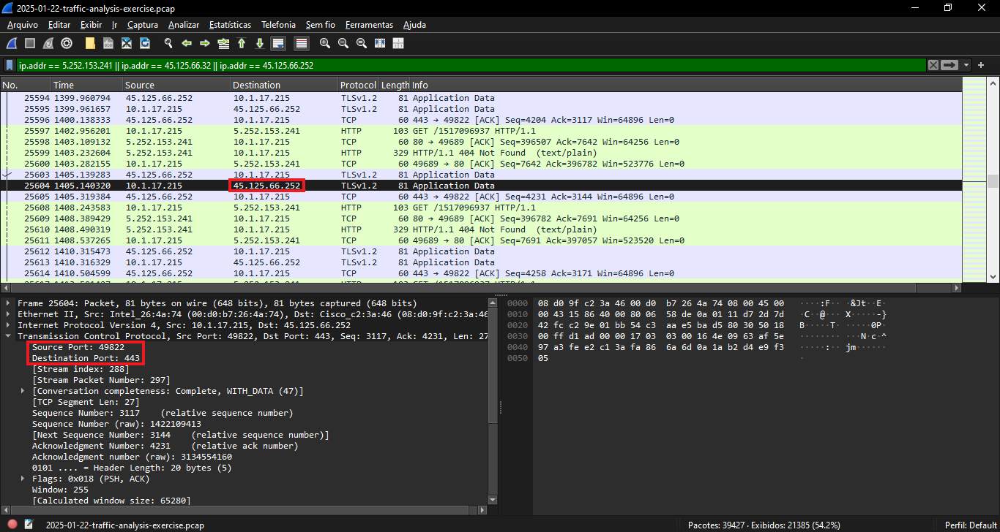
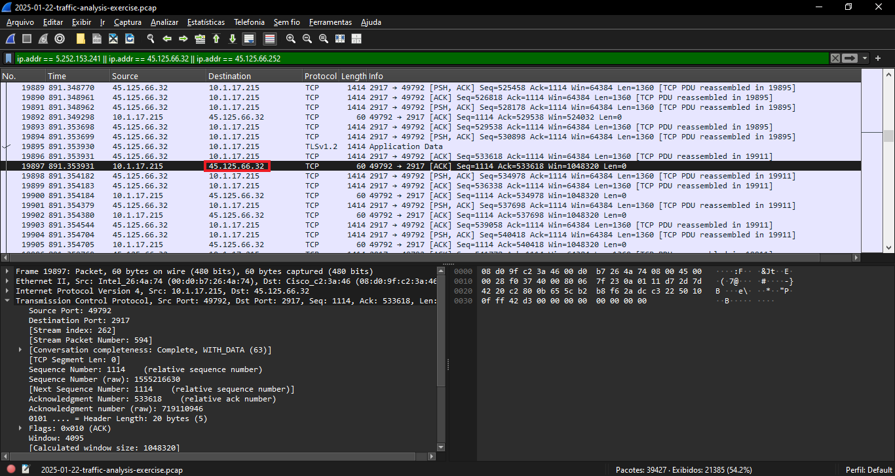

# Análise Forense de Tráfego de Rede: Fake Software Site

Data da Análise: 26/10/2025<br>
Ferramenta: Wireshark<br>
Fonte do Desafio: Malware-Traffic-Analysis.net (2025-01-22)<br>
Link do Exercício: https://www.malware-traffic-analysis.net/2025/01/22/index.html<br>

---

## 1. Resumo do Incidente
(Descrição tirada do site) Identificamos um host interno comprometido após o usuário acessar um domínio de typosquatting através de um anúncio malicioso. A máquina realizou o download de um artefato e iniciou comunicação com servidores de Comando e Controle (C2).

## 2. Identificação da Vítima

| Atributo | Valor Identificado |
| :--- | :--- |
| IP | 10.1.17.215 |
| MAC | 00:0d:b7:26:4a:74 |
| Hostname | DESKTOP-P43IU7F |
| Usuário | shutchenson |

Evidência 1 - Identificação do IP, MAC, Host e Usuário (Kerberos):





---

## 3. Análise Técnica

### 3.1 Vetor de Infecção
O usuário acessou o domínio authenticatoor.org (dois 'o'), simulando o site oficial.

Evidência 2 - Requisição HTTP Maliciosa:


### 3.2 Tráfego de Comando e Controle (C2)
Após a infecção, a máquina comunicou-se com IPs externos suspeitos identificados através de análise de filtro.

Identificação da comunicação com servidores C2:


Evidência 3 - Comunicação com C2 (5.252.153.241):


Evidência 4 - Comunicação com C2 (45.125.66.252):


Evidência 5 - Comunicação com C2 (45.125.66.32):


---

## 4. Indicadores de Comprometimento (IoCs)
Arquivo csv pronto para importação em SIEM/Firewall: [iocs.csv](./iocs.csv)

```csv
Type,Value,Description
Domain,authenticatoor.org,Phishing URL
IP,5.252.153.241,C2 Server
IP,45.125.66.32,C2 Server
IP,45.125.66.252,C2 Server
```
---

Autor: @rfxz-vault
